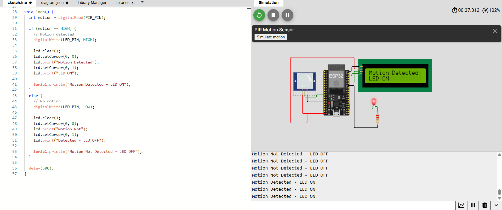
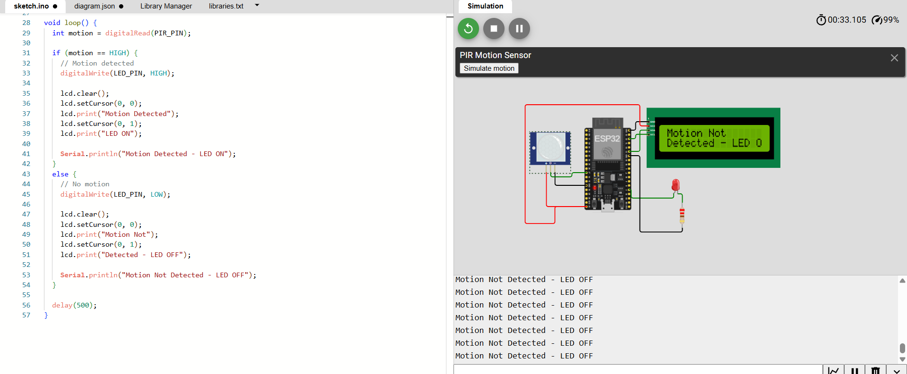

# codealpha_shivnareshbidave_iot_task2
PIR based motion detection and LED control system using ESP32

# PIR Motion Detection and LED Control using ESP32

## Project Overview

This project is a PIR-based motion detection system using ESP32. The system detects motion using a PIR sensor and controls an LED according to the detected motion. A 16×2 I2C LCD is used to display the motion and LED status.

## Components Used

- ESP32
- PIR Motion Sensor
- LED
- 220Ω Resistor
- 16×2 I2C LCD
- Jumper Wires

## Pin Connections

| Component | ESP32 Pin |
|---|---|
| PIR OUT | GPIO 27 |
| PIR VCC | 5V |
| PIR GND | GND |
| LED | GPIO 2 |
| LCD SDA | GPIO 21 |
| LCD SCL | GPIO 22 |
| LCD VCC | 5V |
| LCD GND | GND |

## Working

The PIR sensor continuously detects motion.

- When motion is detected, the LED turns ON and the LCD displays:
  **Motion Detected**
  **LED ON**

- When no motion is detected, the LED turns OFF and the LCD displays:
  **Motion Not Detected**
  **LED OFF**

The current status is also displayed on the Serial Monitor.

## Simulation Output

### Motion Detected - LED ON

The PIR sensor detects motion and the LED turns ON.

### Motion Not Detected - LED OFF

When no motion is detected, the LED turns OFF.

## Code Explanation

The program uses the `Wire.h` library for I2C communication and the `LiquidCrystal_I2C.h` library to control the LCD. The PIR sensor is configured as an input and the LED is configured as an output.

The ESP32 continuously reads the PIR sensor. If the sensor output is HIGH, motion is detected, the LED is turned ON, and the LCD displays the motion status. If the sensor output is LOW, the LED is turned OFF and the LCD displays that no motion is detected.
